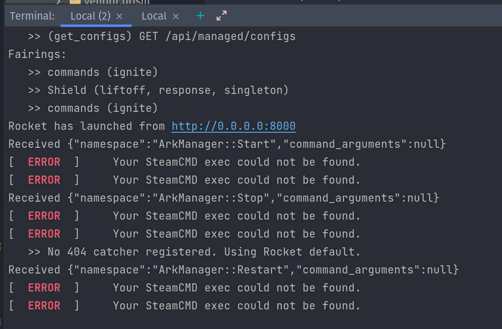

# Ark Manager Web

---

## Disclaimer

> This project has gone through a major rewrite and the project you knew it as is no more! Why?
It was riddled with out of date & no longer supported technology. Angular 1 is dead & ruby just couldnt keep up with concurrent requests.

1) This project is designed for single instances in mind. 

2) This software is provided to you without any authentication or access based security
it is up to you the user to install or develop your own security methods and best practices.

3) There may be future effort for security on this code base but only if its in popular demand.

##### Migrating from Angular 1 version

I have NOT tested it as this project is from 2016-2017 but this should be able to be a drop in replacement.

## Usage

```shell
mkdir -p ./ARK
dockergit add --all
 girun -d \
  -p "8000:8000" \
  -p "32330:32330" \
  -p "7777:7777/tcp" \
  -p "7777:7777/udp" \
  -p "7778:7778/tcp" \
  -p "7778:7778/udp" \
  -p "27016:27016/tcp" \
  -p "27016:27016/udp"  \
  --mount "type=bind,source=$(pwd)/ARK,target=/home/steam/ARK" \
  --mount "type=bind,source=$(pwd)/config,target=/etc/arkmanager/" \
  --user=steam \
  mbround18/ark-manager-web:latest
```

## Recommendations

 - If you are hosting this on a server, it is recommended to set this up behind a `nginx` reverse proxy with http basic auth & ssl for port 8000;
 - You do not need to volume mount the `/tmp/ark-manager-web` directory. It can be destroyed at any point.

## Sub Projects

- [Agent](./agent/README.md)
- [Client](./client/README.md)
- [Server](./server/README.md)


## Gotchya's 

- If you see the error below you can ignore it:

  

